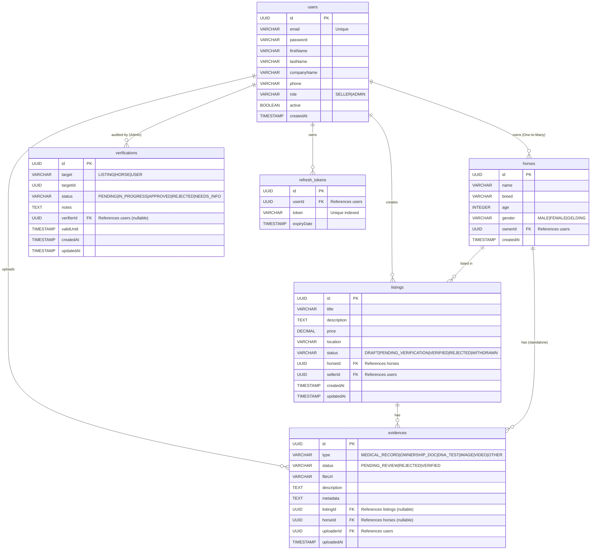

# 🗄️ Diccionario y Diagrama de Base de Datos

Equine Verification Backend mantiene el modelo Relacional sobre motor **PostgreSQL** para prever la escalabilidad en producción. La estructura de Foreign Keys bloquea la insersión de falsos positivos en el servidor. Todas las claves primarias (`Primary Keys`) son universales representadas por `UUID` V4.

## Notas Técnicas del Esquema JPA
* **Cascadas:** En H2 y PostgreSQL nos apalancamos en persistencia huérfana (Orphan Removal). Eliminar un usuario forzará borrado en cascada (CascadeType.ALL) de `refresh_tokens`.
* **Polimorfismo mitigado:** La tabla `verifications` no asocia por ForeignKey un objeto fuerte (Listing, etc), sino que enruta flexiblemente con el texto del `target` y su `targetId`. Esto le permite a futuro verificar a caballos mismos que no tengan venta temporal o inclusive un usuario general.
* **Tiempos Base (`Auditing`):** A nivel tabla todas las Entidades operan con los timestamps provistos por Hibernate de Creación `createdAt` (`@CreationTimestamp`) y de Actalización `updatedAt` (`@UpdateTimestamp`).
