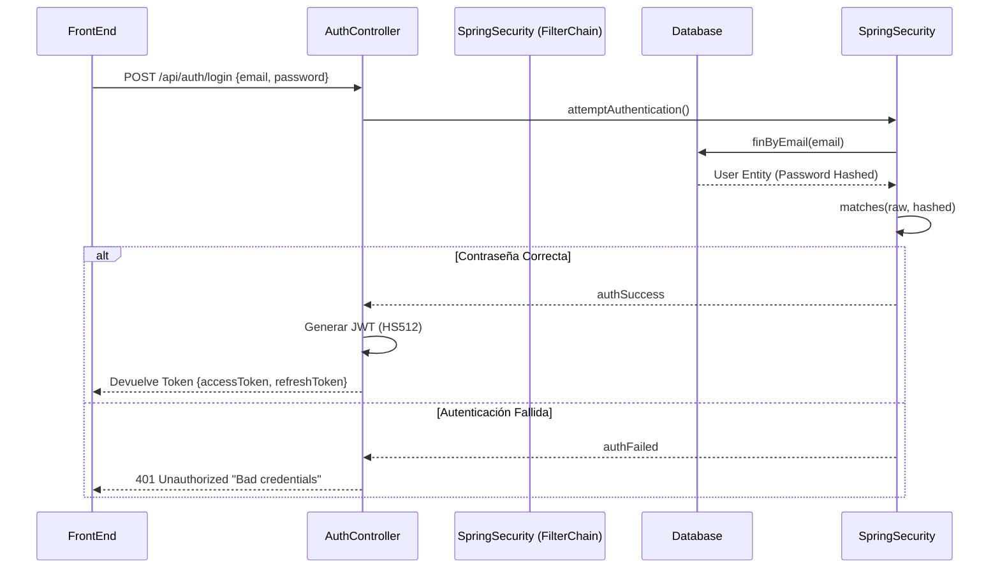
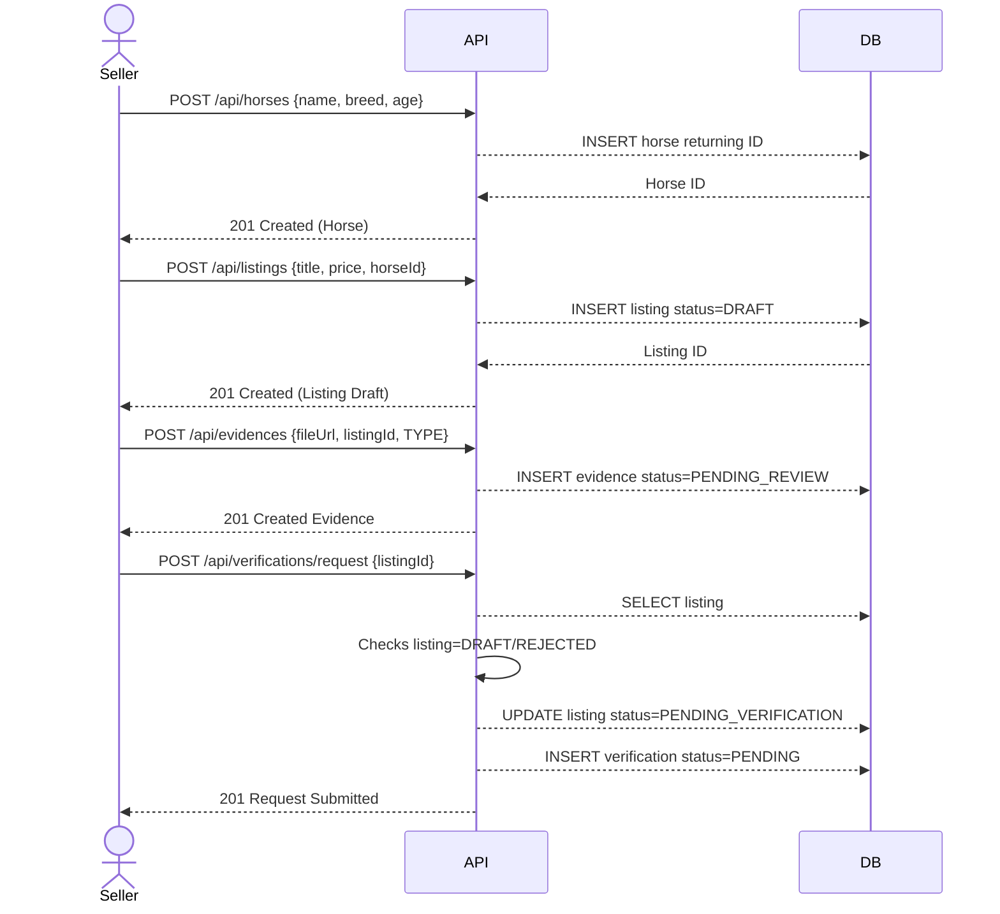
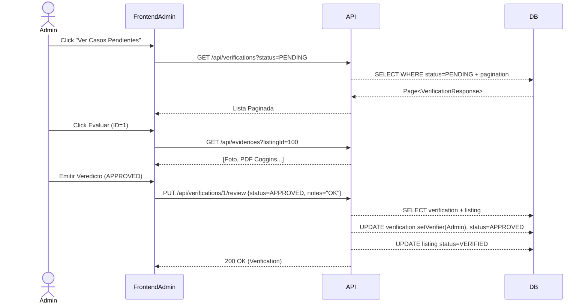

# 🔄 Flujos del Sistema (Diagramas de Secuencia)

La operación del portal confiere secuencias robustas y atómicas a través del manejo de Tokens Bearer de SpringBoot.

## 1. Login y Generación de Token
El protocolo obligatorio para todos los `User` (Sellers o Admins). Mapeo sobre Endpoints abriertos `/api/auth`.

## 2. Creación de Anuncio y Petición de Verificación (Rol Seller)
Este flujo visualiza el paso crítico desde insertar en `DRAFT` hasta someterse a Inspección.

## 3. Revisión del Administrador (Rol Admin)
Intervención y resolución sobre Anuncios congelados.

